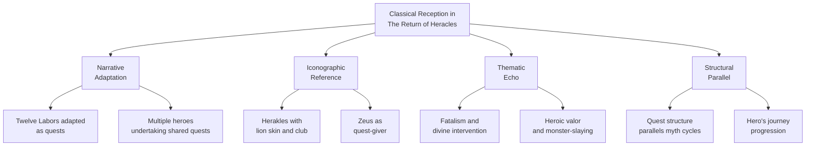

# The Return of Heracles

<div align="center">
  
  <p><em>The Return of Heracles Cover (1983)</em></p>
</div>


> [!info]- Game Info at a Glance  
> **Title:** The Return of Heracles  
> **Developer:** Stuart Smith  
> **Publisher:** Quality Software, Electronic Arts (in Age of Adventure)  
> **Year:** 1983  
> **Platforms:** Apple II, Atari 8-bit, Commodore 64  
> **Genre:** Role-Playing Game (RPG)  
> **Players:** 1-4 players (cooperative multiplayer)  
> **Modern Access:** Available via emulation (archive.org: https://archive.org/details/a2_Return_of_Heracles_1983_Stuart_Smith)

## Game Overview

*The Return of Heracles* is a **mythologically rich RPG designed in 1983 by Stuart Smith** featuring a **mythic, chaotic, ironic, and darkly humorous** mood. This pioneering title transforms Greek mythology into an interactive adventure where players navigate a nonlinear world with both educational and entertainment elements.

> [!note]- Core Gameplay Elements
> - **Quest-driven nonlinear progression** guided by the Oracle of Zeus
> - **Turn-based combat system** with mythologically authentic encounters
> - **Up to 4-player cooperative multiplayer** with dynamic hero selection from 19 playable characters
> - **Educational approach** to Greek mythology through gameplay and the manual's extensive glossary
> - **Character advancement** through increasing strength, finding weapons, and acquiring treasures


## Locations

| Name | Coordinates | Description | Certainty | Pleiades ID | Heracles Context |
|------|-------------|-------------|-----------|-------------|------------------|
| Athens | [37.9838, 23.7275] | Home of Theseus, a major city-state and hub in the game | Confirmed | [579885](https://pleiades.stoa.org/places/579885) | Story hub |
| Thebes | [38.3191, 23.3176] | Setting of many Greek myths, site to kill the Serpent of Ares (Cadmus' tale) and the Sphinx riddle (Oedipus' tale) | Confirmed | [541138](https://pleiades.stoa.org/places/541138) | Non-Heracles quest |
| Mycenae | [37.7309, 22.7564] | Kingdom of heroes, associated with Agamemnon | Confirmed | [570468](https://pleiades.stoa.org/places/570468) | Background setting |
| Argos | [37.6311, 22.7195] | City of Perseus, a significant city-state | Confirmed | [570065](https://pleiades.stoa.org/places/570065) | Background setting |
| Mt. Olympus | [40.0856, 22.3586] | Home of the gods, where Zeus assigns quests | Confirmed | [491677](https://pleiades.stoa.org/places/491677) | Quest initiation |
| Crete | [35.2401, 24.8093] | Location of the Minotaur, site of Theseus' quest | Confirmed | [589748](https://pleiades.stoa.org/places/589748) | Non-Heracles quest |
| Troy | [39.9575, 26.2389] | Site of the Trojan War, where Helen is rescued | Confirmed | [550935](https://pleiades.stoa.org/places/550935) | Non-Heracles quest |
| Stymphalos | [37.8667, 22.4667] | Home of the Stymphalian Birds, adapted as a treasure recovery quest | Confirmed | [570679](https://pleiades.stoa.org/places/570679) | Adapted Labor 6 |
| Lerna | [37.3097, 22.7177] | Lair of the Hydra in the Lernaean Swamp | Confirmed | [570413](https://pleiades.stoa.org/places/570413) | Labor 2 |
| Erymanthus | [37.9667, 21.8333] | Habitat of the Erymanthian Boar | Confirmed | [570219](https://pleiades.stoa.org/places/570219) | Labor 4 |
| Delphi | [38.4824, 22.5010] | Site of the Oracle, guiding quests | Confirmed | [540726](https://pleiades.stoa.org/places/540726) | Quest initiation |
| Hesperides | [32.0000, -7.0000] | Garden of the golden apples, in the far west | Mythical |  | Labor 11 |
| Nemean Woods | [37.8081, 22.7127] | Lair of the Nemean Lion, near Nemea | Confirmed | [570492](https://pleiades.stoa.org/places/570492) | Labor 1 |
| Aeaea | Unknown | Island home of Circe, a mythical location referenced in the manual | Mythical |  | Background setting |
| Mines of Laurion | [37.7167, 24.0500] | Resource location near Athens, referenced in the manual as a contextual setting | Approximate | [580013](https://pleiades.stoa.org/places/580013) | Background setting |
| Liguria | [44.4111, 8.9327] | Coastal region, possibly confused with Erytheia or a background setting in the manual | Approximate | [383707](https://pleiades.stoa.org/places/383707) | Background setting |
| Elysium | Unknown | Mythical afterlife realm, referenced in the manual as a background setting | Mythical |  | Background setting |
| Colchis | [42.1900, 41.6800] | Location to recover the Golden Fleece (Jason's tale) | Confirmed | [857147](https://pleiades.stoa.org/places/857147) | Non-Heracles quest |
| Ithaca | [38.3600, 20.7100] | Site to rescue Penelope (Odysseus' tale) | Confirmed | [530906](https://pleiades.stoa.org/places/530906) | Non-Heracles quest |
| Thrace | [41.0000, 25.0000] | Site to kill Diomedes' Mares | Approximate | [501392](https://pleiades.stoa.org/places/501392) | Labor 8 |
| Peloponnesian Peninsula | [37.5000, 22.5000] | Southern Greece, encompassing multiple quest locations | Confirmed |  | Regional setting |
| Mt. Pontinus | [37.3000, 22.7000] | Source of water feeding the Lernaean Swamp | Approximate |  | Labor 2 support |
| Orchomenus | [38.4928, 22.9797] | Large forest, a significant natural area | Confirmed | [541004](https://pleiades.stoa.org/places/541004) | Background setting |
| Abas | [32.5333, -5.4167] | Mountain in northwestern Africa, possibly a game reference | Approximate |  | Background setting |

## Map


```leaflet
id: The_Return_of_Heracles-map
lat: 39.0
long: 20.0
zoom: 5
height: 600px
tile: OpenStreetMap
marker: Athens,37.9838,23.7275,Athens - Home of Theseus, a major city-state and hub in the game
marker: Thebes,38.3191,23.3176,Thebes - Setting of many Greek myths, site to kill the Serpent of Ares (Cadmus' tale) and the Sphinx riddle (Oedipus' tale)
marker: Mycenae,37.7309,22.7564,Mycenae - Kingdom of heroes, associated with Agamemnon
marker: Argos,37.6311,22.7195,Argos - City of Perseus, a significant city-state
marker: Mt. Olympus,40.0856,22.3586,Mt. Olympus - Home of the gods, where Zeus assigns quests
marker: Crete,35.2401,24.8093,Crete - Location of the Minotaur, site of Theseus' quest
marker: Troy,39.9575,26.2389,Troy - Site of the Trojan War, where Helen is rescued
marker: Stymphalos,37.8667,22.4667,Stymphalos - Home of the Stymphalian Birds, adapted as a treasure recovery quest
marker: Lerna,37.3097,22.7177,Lerna - Lair of the Hydra in the Lernaean Swamp
marker: Erymanthus,37.9667,21.8333,Erymanthus - Habitat of the Erymanthian Boar
marker: Delphi,38.4824,22.5010,Delphi - Site of the Oracle, guiding quests
marker: Hesperides,32.0000,-7.0000,Hesperides - Garden of the golden apples, in the far west
marker: Nemean Woods,37.8081,22.7127,Nemean Woods - Lair of the Nemean Lion, near Nemea
marker: Mines of Laurion,37.7167,24.0500,Mines of Laurion - Resource location near Athens, referenced in the manual as a contextual setting
marker: Liguria,44.4111,8.9327,Liguria - Coastal region, possibly confused with Erytheia or a background setting in the manual
marker: Colchis,42.1900,41.6800,Colchis - Location to recover the Golden Fleece (Jason's tale)
marker: Ithaca,38.3600,20.7100,Ithaca - Site to rescue Penelope (Odysseus' tale)
marker: Thrace,41.0000,25.0000,Thrace - Site to kill Diomedes' Mares
marker: Peloponnesian Peninsula,37.5000,22.5000,Peloponnesian Peninsula - Southern Greece, encompassing multiple quest locations
marker: Mt. Pontinus,37.3000,22.7000,Mt. Pontinus - Source of water feeding the Lernaean Swamp
marker: Orchomenus,38.4928,22.9797,Orchomenus - Large forest, a significant natural area
marker: Abas,32.5333,-5.4167,Abas - Mountain in northwestern Africa, possibly a game reference


### Mythological Characters

The game features an impressive roster of characters from Greek mythology:

> [!heroes]- Characters
>**Major Heroes:**  
>- **Herakles:** Superior strength, can complete the Twelve Labors  
>- **Jason:** Seeker of the Golden Fleece  
>- **Odysseus:** Known for cunning and wit  
>- **Achilles:** Nearly invulnerable warrior  
>- **Theseus:** Slayer of the Minotaur  
>- **Perseus:** "Destroyer," fathered by Zeus in a dungeon  
>- **Asclepius:** "Unceasingly Gentle," son of Apollo and Coronis  
>- **Hippolyta:** Queen of the Amazons, daughter of Ares and Harmonia  
>- **Castor & Polydeuces:** The Dioscuri, inseparable brothers  
>- **Palaemon:** "Wrestler," can transform into Heracles  
>
>**Additional Heroes:**  
>- Helen, Atlanta, Melanippe, and others  
>
>**Gods and Notable NPCs:**  
>- **Olympian Gods:** Zeus (quest-giver), Apollo, Artemis, Athene, Hera, Hermes, Poseidon, Hades  
>- **Trojan War Figures:** Paris, Hector, Aeneas, Priam, Patroclus  
>- **Other Mythical Figures:** Medusa, Circe, Minos, Prometheus, Autolycus, Bellerophon, Cadmus  
>- **Historical Figures:** Socrates, Pythagoras, Euripides, Virgil  
>
>**Complete Character List:**  
>Achilles, Acmon, Actaeon, Aeneas, Agelaus of Same, Agrius, Ajax, Amphitryon, Amycus, Amymone, Anchises, Ancius, Antaeus, Antenor, Antinous, Apollo, Ares, Artemis, Asclepius, Athene, Autolycus, Bellerophon, Brontes, Cadmus, Carya, Caryatid, Cassandra, Castor, Cecrops, Cheiron, Chthonius, Circe, Cytisorus, Daedalus, Dascylus, Deileon, Deiphobus, Dercynus, Diomedes, Dioscuri, Dryad, Dryope, Echion, Endymion, Eumaeus, Euripides, Eurybatus, Eurydice, Eurymachus, Eurytion, Geryon, Hades, Hector, Helen, Hephaestus, Hera, Heracles, Hermes, Hesperides, Hippolyte, Ialebion, Irus, Janus, Jason, Lamia, Leda, Lycus, Medea, Medusa, Melanion, Melanippe, Melantheus, Memnon, Mestor, Minos, Naiad, Narcissus, Nephele, Odysseus, Olus, Omphale, Oreus, Orion, Palaemon, Paris, Pasiphae, Passalus, Patroclus, Penelope, Penthesileia, Perseus, Phereclus, Philopoemen, Phineas, Pholus, Phoroneus, Phrixus, Phyllis, Polites, Polybius, Polydeuces, Polydorus, Poseidon, Priam, Prometheus, Pythagoras, Rhadamanthys, Sarpedon, Scythian Guard, Selene, Sisyphus, Socrates, Steropes, Teiresias, Telemachus, Tenes, Theseus, Troilus, Udaeus, Virgil, Zeus


### Monsters and Creatures

Players encounter a diverse bestiary throughout ancient Greece:

>[!danger]- Monsters and Creatures
>**Players encounter a diverse bestiary throughout ancient Greece:**
>
>### **Labor-Related Monsters:**
>- **Nemean Lion**: Enormous beast with an almost impregnable hide  
>- **Lernaean Hydra**: Many-headed water serpent that regenerates heads  
>- **Ceryneian Hind**: Golden-horned deer  
>- **Erymanthian Boar**: Fierce, enormous beast from the mountains  
>- **Stymphalian Birds**: Man-eating ibis-like birds with metal-piercing beaks  
>- **Cretan Bull**: Divine bull of Poseidon  
>- **Mares of Diomedes**: Man-eating horses *(Lampon, Podargus, Xanthus, Deinus)*  
>- **Cerberus**: Three-headed hound of the Underworld  
>
>### **Other Mythological Creatures:**
>- **Minotaur (Asterius)**: Monster with a bull's head and human body  
>- **Talos**: Bull-headed bronze servant guarding Crete  
>- **Cyclopes**: One-eyed giants *(including Brontes and Steropes)*  
>- **Sphinx**: Monster with lion's body, serpent's tail, eagle's wings, and woman's head  
>- **Centaurs**: Horse-bodied warriors *(Cheiron, Pholus, Ancius, Agrius, Oreus)*  
>- **Harpies**: Winged female creatures *(Aeollopus, Ocypete)*  
>- **Hunting Dogs**: Dorceus, Lelaps, Melampus, Nape, Pamphagus, Theron, Argus  
>
>### **Complete Creature List:**  
>Aeollopus, Asterius *(Minotaur)*, Briareus, Cacus, Calydonian Boar, Centaurs, Cerberus, Charybdis, Chimaera, Cyclopes, Deinus, Dorceus, Echidne, Erymanthian Boar, Harpy, Hydra, Ladon, Lampon, Lelaps, Melampus, Minotaur, Nape, Nemean Lion, Ocypete, Orthrus, Pamphagus, Pegasus, Podargus, Roc, Scylla, Sphinx, Talos, Theron, Xanthus, Argus


### Equipment and Objects

Heroes can acquire various items to aid their quests:

>[!gear]- Weapons, Equipment and Objects  
>**Heroes can acquire various items to aid their quests:**  
>
>### **Weapons:**  
>- **Club** *(Herakles' signature weapon)*  
>- **Swords** *(standard weapon)*  
>- **Daggers** *(lighter weapons)*  
>- **Minotaur's Axe** *(special weapon)*  
>- **Poisoned weapons** *(coated with Hydra blood)*  
>- **Fists** *(Polydeuces' specialty)*  
>
>### **Armor:**  
>- **Standard armor sets**  
>- **Nemean Lion's skin** *(special armor)*  
>
>### **Currency and Items:**  
>- **Drachma** *(standard Greek currency)*  
>- **Obol** *(smaller monetary unit)*  
>- **Ostrakon** *(broken pottery used as ballot)*  
>- **Lyre** *(stringed instrument tuned to E, A, B below middle C and D above middle C)*  
>- **Garland** *(winner's wreath for Panhellenic games)*  
>
>### **Mythological Objects:**  
>- **Golden Apples of the Hesperides**  
>- **Girdle of Hippolyta**  
>- **Cattle of Geryon**  
>- **Sparti** *(“Sown Men” from serpent teeth)*  
>- **Oak tree** *(sacred in many locations)*

## Classical Reception Analysis

### Ancient Sources and Influences

The game draws from multiple classical sources to create its mythological framework. 

> [!cite]- Literary Sources
> - **Robert Graves:** Primary inspiration for the developer Stuart Smith according to game [[01-The Return of Heracles.pdf|manual]]


> [!abstract]- Artistic Influences
> While constrained by 8-bit graphics, the game's visual representations echo classical Greek iconography:
> - Herakles depicted with club and lion skin (traditional attributes)
> - Zeus portrayed with throne and lightning (standard iconography)
> - Monster designs reflecting vase paintings and sculptures where possible


### Categorisation of Survival

*The Return of Heracles* represents a multi-faceted adaptation of classical material. The following diagram illustrates how the game transforms ancient Greek mythology through four distinct but interconnected pathways: narrative adaptation, iconographic reference, thematic echo, and structural parallel. Each branch shows specific examples of how classical elements survive and transform through the digital medium of an 8-bit RPG.




> [!abstract]- Transformation Mechanisms
> - Narrative Compression: Myths adapted into discrete quest structures
> - Playable Reinterpretation: Heroes become player avatars with agency
> - Temporal Flexibility: Various mythic figures from different eras coexist
> - Emergent Storytelling: Random elements create unique mythic narratives
> - Rule-Based Mythology: Divine will expressed through game mechanics

### Digital Media Considerations

The game's technical constraints shaped its representation of mythology (to be adapted):

> [!technical]- 8-bit Era Limitations and Solutions
> The game's technical constraints shaped its representation of mythology:
> - Graphical Constraints: Simplified visual representations compensated by naming and textual descriptions
> - Memory Limitations: Focused on key mythological elements rather than comprehensive coverage
> - Interface Restrictions: Text-heavy storytelling to convey mythological depth
> - Emergent Mechanics: Randomised events simulate divine unpredictability
> - Rule Systems: Game mechanics encode mythological concepts (fate, divine wrath)

## Narrative Analysis

### Herakles' Role and Characterisation

> [!character]- Herakles in the Game
> - Role: Central playable hero among 19 mythological figures
> - Attributes: Superior strength and combat skills
> - Quest Arc: Completion of the Twelve Labors
> - Characterisation: Classical strongman archetype with cooperative potential
> - Transformative Element: Palaemon can transform into Herakles, suggesting fluidity of heroic identity
> - Position: One of multiple viable protagonists, decentralising his mythic supremacy

### Mythological Narrative Elements

The game weaves multiple mythic narratives into its nonlinear structure:

> [!timeline]- Mythological Narrative Framework
> - Oracle Revelation: Zeus assigns quests through the Oracle
> - Labor Adaptation: Twelve Labors form core quest structure
> - Multi-hero Integration: Various heroes' myths interwoven into the gameplay

> [!analysis]- Classical Reception Innovation
> - **First comprehensive adaptation** of Greek mythology into RPG format
> - Use of **Greek name 'Herakles'** indicating commitment to authenticity
> - **Educational approach** balancing entertainment with learning
> - **Multiplayer interaction** with mythological narrative
> - **Randomised elements** reflecting the concept of fate in Greek thought


## Assets Gallery

to be done

## References
- CRPG Addict. (2014, July 11). *Game 153: The Return of Heracles (1983)*. The CRPG Addict.
- Gerli, D. (2022, February 14). *7 More Great Turn-Based Games On The Commodore 64*. Turn Based Lovers.
- Lemon, K. (n.d.). *Age of Adventure: The Return of Heracles*. Lemon64.com.
- *The Return of Heracles*. (n.d.). Atarimania.com - 400 800 XL XE.
- *The Return of Heracles*. (n.d.). MobyGames.
- *The Return of Heracles*. (2021, December 1). Wikipedia.
- *The Return of Heracles*. (2023, September 14). Wikipedia.
- *Heracles in popular culture*. (2024, April 26). Wikipedia.
- Retro Games Trove. (2022). *The Return of Heracles*.
- Smith, S. (1983). *The Return of Heracles Manual*. Quality Software.